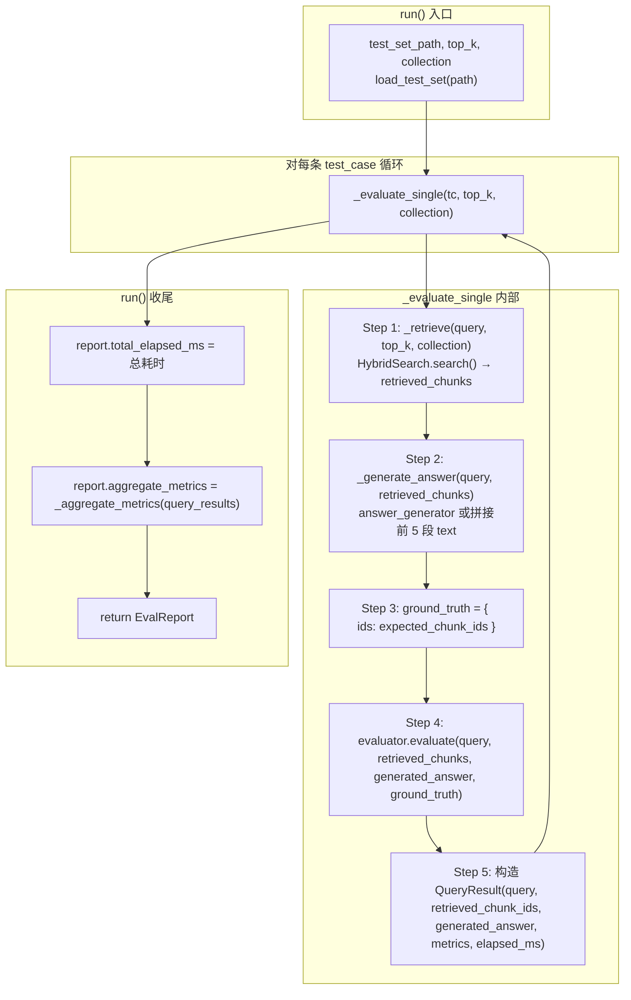

# Evaluation 阶段流程详解（结合 eval_runner.py）

本文档按 **`src/observability/evaluation/eval_runner.py`** 中的 `EvalRunner.run()` 实际执行顺序，以及 **`scripts/evaluate.py`** / **Dashboard Evaluation Panel** 的调用链，用流程图 + 每步的**数据示例**和**方法调用**说明 Evaluate 阶段框架。

---

## 一、入口与整体流程（对应代码）

主入口有两类：

1. **命令行**：`scripts/evaluate.py` 的 `main()` → 创建 `EvaluatorFactory.create(settings)`、可选 `HybridSearch`、`EvalRunner` → `runner.run(test_set_path, top_k, collection)`
2. **Dashboard**：`src/observability/dashboard/pages/evaluation_panel.py` 的「Run evaluation」→ `_execute_evaluation()` 内同样用 `EvalRunner` + `EvaluatorFactory`；另在 **Query Traces** 页有单条 trace 的「Ragas 评估」按钮，对单次查询重跑检索并调用 Ragas。

编排核心是 **`EvalRunner.run(test_set_path, top_k, collection)`**：加载 golden test set，对每条用例执行「检索 → 生成答案 → 调用 Evaluator 打分」，再汇总为 `EvalReport`。

### 1.1 与 EvalRunner.run() 一一对应的流程图



### 1.2 阶段一览（变量与方法）

| 阶段 | run() 中变量/返回值 | 主要方法调用 |
|------|---------------------|--------------|
| 加载用例 | `test_cases: List[GoldenTestCase]` | `load_test_set(test_set_path)` → 解析 JSON 的 `test_cases` |
| 单条评估 | `QueryResult` 列表 | `_evaluate_single(tc, top_k, collection)` |
| 检索 | `retrieved_chunks` | `_retrieve()` → `hybrid_search.search(query, top_k, filters)` |
| 生成答案 | `generated_answer` | `_generate_answer()` → 自定义 answer_generator 或拼接 chunk 文本 |
| 打分 | `metrics: Dict[str, float]` | `evaluator.evaluate(query, retrieved_chunks, generated_answer, ground_truth)` |
| 汇总 | `EvalReport` | `_aggregate_metrics(query_results)` 求各指标平均值 |

**配置来源**：`config/settings.yaml` 的 `evaluation.enabled`、`evaluation.provider`（custom / ragas / composite）、`evaluation.metrics`。

---

## 二、Golden Test Set 格式

路径默认：`tests/fixtures/golden_test_set.json`。

**结构**：

```json
{
  "description": "Golden test set for Modular RAG MCP Server evaluation.",
  "version": "1.0",
  "test_cases": [
    {
      "query": "What is Modular RAG?",
      "expected_chunk_ids": [],
      "expected_sources": [],
      "reference_answer": "Modular RAG is a Retrieval-Augmented Generation system..."
    }
  ]
}
```

| 字段 | 说明 | 用途 |
|------|------|------|
| `query` | 测试查询字符串 | 传入 HybridSearch 与 Evaluator |
| `expected_chunk_ids` | 期望命中的 chunk ID 列表 | CustomEvaluator 的 hit_rate、MRR 等 IR 指标 |
| `expected_sources` | 期望来源文件（可选） | 预留，当前未参与计算 |
| `reference_answer` | 参考答案（可选） | 可用于扩展；Ragas 不依赖，用 generated_answer |

加载逻辑：`load_test_set(path)` 读取 JSON，校验存在 `test_cases` 键，再对每项调用 `GoldenTestCase.from_dict(tc)`。  
**代码位置**：`eval_runner.py` 的 `load_test_set()`、`GoldenTestCase`。

---

## 三、单条评估详解：_evaluate_single()

**输入**：`GoldenTestCase`（query、expected_chunk_ids、expected_sources、reference_answer）、`top_k`、`collection`。

**输出**：`QueryResult`（query、retrieved_chunk_ids、generated_answer、metrics、elapsed_ms）。

### 3.1 步骤 1：检索 _retrieve()

- 若 `hybrid_search is None`（例如 `--no-search`）：返回空列表。
- 否则：`hybrid_search.search(query=test_case.query, top_k=top_k, filters={"collection": collection} if collection else None)`，得到 `List[RetrievalResult]` 或 `HybridSearchResult.results`；再从中用 `_get_chunk_id(c)` 得到 `retrieved_chunk_ids`。

**代码位置**：`eval_runner.py` 的 `_retrieve()`、`_get_chunk_id()`。

### 3.2 步骤 2：生成答案 _generate_answer()

- 若配置了 `answer_generator`（callable(query, chunks) -> str）：调用它得到 `generated_answer`。
- 否则：用前 5 个 chunk 的 text 拼接成一段字符串作为占位答案（无 LLM 时 Ragas 仍需要非空 `generated_answer`，通常需在外部提供 answer_generator 或使用占位）。

**代码位置**：`eval_runner.py` 的 `_generate_answer()`。

### 3.3 步骤 3：构造 ground_truth

- `ground_truth = {"ids": test_case.expected_chunk_ids}` 若 `expected_chunk_ids` 非空，否则 `ground_truth = None`。
- 供 CustomEvaluator 计算 hit_rate、MRR；Ragas 不使用。

### 3.4 步骤 4：evaluator.evaluate()

- 调用 `self.evaluator.evaluate(query=..., retrieved_chunks=..., generated_answer=..., ground_truth=...)`，返回 `Dict[str, float]`（指标名 → 分数）。
- 若抛错则记录 warning，该条 `qr.metrics = {}`。

**代码位置**：`eval_runner.py` 的 `_evaluate_single()` 内 Step 4。

---

## 四、Evaluator 实现（三种 Provider）

通过 **`EvaluatorFactory.create(settings)`** 根据 `evaluation.provider` 选择实现；`evaluation.enabled: false` 或 provider 为 `none`/`disabled` 时返回 **NoneEvaluator**（evaluate 返回空字典）。

### 4.1 CustomEvaluator（provider: custom）

- **文件**：`src/libs/evaluator/custom_evaluator.py`
- **指标**：`hit_rate`、`mrr`（需 ground_truth 中的期望 chunk IDs）。
- **逻辑**：从 `retrieved_chunks` 提取 ID，从 `ground_truth["ids"]` 取期望 ID；hit_rate = 至少命中一个期望 ID 的比例（按条可理解为该条是否命中）；MRR = 第一个命中位置的倒数。
- **特点**：无外部依赖，适合回归与轻量 IR 评估。

### 4.2 RagasEvaluator（provider: ragas）

- **文件**：`src/observability/evaluation/ragas_evaluator.py`
- **依赖**：`pip install ragas datasets`；未安装时工厂创建会报错或提示。
- **指标**：`faithfulness`（答案是否忠于上下文）、`answer_relevancy`（答案与问题相关性）、`context_precision`（检索片段相关性与顺序）。由 `evaluation.metrics` 配置子集。
- **要求**：`generated_answer` 必填且非空（LLM-as-Judge 需要答案文本）。
- **实现**：从 settings 构建 LLM/Embeddings 包装，调用 Ragas 的 `Faithfulness`、`AnswerRelevancy`、`ContextPrecisionWithoutReference` 等 per-metric `score()`，返回 0~1 分数。

### 4.3 CompositeEvaluator（provider: composite）

- **文件**：`src/observability/evaluation/composite_evaluator.py`
- **逻辑**：内部持有多组 `BaseEvaluator`（可由 `evaluation.backends` 等配置构建），对同一次 `evaluate()` 调用依次执行各子 evaluator，将返回的 metrics 合并；同名字段后者覆盖并打日志。
- **用途**：同时跑 IR 指标（Custom）与 LLM-as-Judge（Ragas）等。

### 4.4 工厂与配置

- **文件**：`src/libs/evaluator/evaluator_factory.py`
- **配置**：`settings.evaluation.provider`、`settings.evaluation.enabled`、`settings.evaluation.metrics`。
- **提供**：`EvaluatorFactory.create(settings)`、`list_providers()`；ragas/composite 为懒加载以规避未安装依赖时的导入错误。

---

## 五、汇总与报告

- **总耗时**：`report.total_elapsed_ms` 为整个 `run()` 的单调时间差（毫秒）。
- **聚合指标**：`_aggregate_metrics(report.query_results)` 对所有 `QueryResult.metrics` 按 key 求平均，得到 `report.aggregate_metrics`。
- **EvalReport**：包含 `query_results`、`aggregate_metrics`、`total_elapsed_ms`、`evaluator_name`、`test_set_path`；`to_dict()` 可序列化为 JSON。

**代码位置**：`eval_runner.py` 的 `EvalReport`、`_aggregate_metrics()`、`run()` 末尾。

---

## 六、入口脚本与 Dashboard 行为

### 6.1 scripts/evaluate.py

| 步骤 | 说明 |
|------|------|
| 1 | 解析 `--test-set`、`--collection`、`--top-k`、`--json`、`--no-search` |
| 2 | `load_settings()`；`EvaluatorFactory.create(settings)` 得到 evaluator |
| 3 | 若未 `--no-search`：按 collection 构建 VectorStore、DenseRetriever、SparseRetriever、HybridSearch；失败则 hybrid_search=None，仍可跑评估（检索为空） |
| 4 | `EvalRunner(settings, hybrid_search, evaluator)`；`runner.run(test_set_path, top_k, collection)` |
| 5 | 若 `--json` 则打印 `report.to_dict()` 的 JSON，否则 `_print_report(report)`（汇总指标 + 每条 query 的检索条数、metrics、耗时） |

### 6.2 Dashboard Evaluation Panel

- 选择 evaluator（custom / ragas / composite）、golden test set 路径、top_k，点击运行后调用与脚本相同的 `EvalRunner` + `EvaluatorFactory`，展示报告并可写入历史（如 JSONL）用于对比。

### 6.3 Query Traces 单条 Ragas 评估

- 对某条已存储的 query trace 点击「Ragas 评估」：用该 query 重新执行 HybridSearch 得到 chunks，用占位或已有答案调用 RagasEvaluator，在 UI 展示单条 metrics 或错误信息。

---

## 七、配置与模块对照

| 配置项 | 文件/位置 | 说明 |
|--------|-----------|------|
| evaluation.enabled | config/settings.yaml | 是否启用评估（false 时工厂返回 NoneEvaluator） |
| evaluation.provider | config/settings.yaml | custom / ragas / composite |
| evaluation.metrics | config/settings.yaml | 指标列表，如 hit_rate、mrr、faithfulness 等 |

| 模块 | 文件 | 职责 |
|------|------|------|
| EvalRunner | src/observability/evaluation/eval_runner.py | 加载 golden set、逐条检索→生成答案→打分、汇总 EvalReport |
| GoldenTestCase / QueryResult / EvalReport | eval_runner.py | 用例与结果数据结构 |
| load_test_set | eval_runner.py | 从 JSON 加载 test_cases |
| BaseEvaluator / NoneEvaluator | src/libs/evaluator/base_evaluator.py | 抽象接口与「禁用」实现 |
| CustomEvaluator | src/libs/evaluator/custom_evaluator.py | hit_rate、MRR（需 ground_truth ids） |
| RagasEvaluator | src/observability/evaluation/ragas_evaluator.py | Ragas LLM-as-Judge 指标 |
| CompositeEvaluator | src/observability/evaluation/composite_evaluator.py | 多 evaluator 组合与指标合并 |
| EvaluatorFactory | src/libs/evaluator/evaluator_factory.py | 按 settings 创建 evaluator |
| 命令行入口 | scripts/evaluate.py | 解析参数、组链、运行 EvalRunner、输出报告 |
| Dashboard | src/observability/dashboard/pages/evaluation_panel.py | 配置 + 运行 + 历史；query_traces 页单条 Ragas |

---

以上为 Evaluation 阶段的框架说明，与 ingestion / query 文档风格一致，便于对照代码阅读和扩展。
