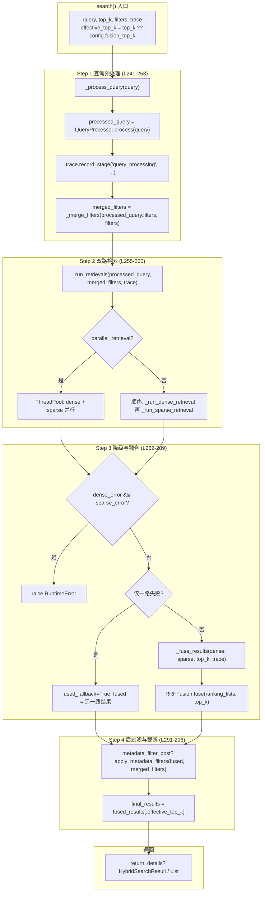
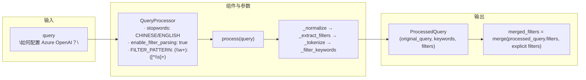
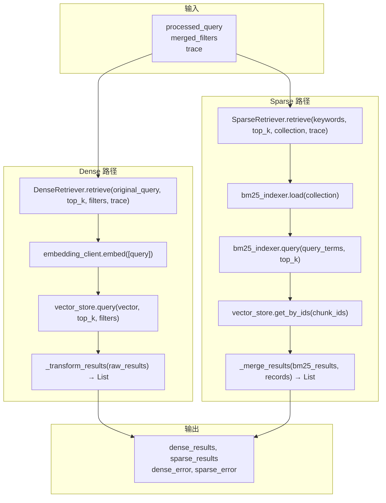
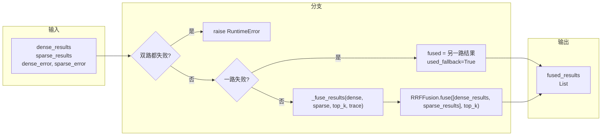
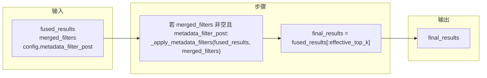

# Query 阶段流程详解（结合 hybrid_search.py）

本文档按 **`src/core/query_engine/hybrid_search.py`** 中的 `HybridSearch.search()` 实际执行顺序，以及 **`scripts/query.py`** / **MCP `query_knowledge_hub`** 的调用链，用流程图 + 每步的**具体数据示例**和**方法调用**说明，方便对照代码理解。

---

## 一、入口与整体流程（对应代码）

主入口有两类：

1. **命令行**：`scripts/query.py` 的 `main()` → `_run_query()` → `hybrid_search.search()` → 可选 `reranker.rerank()`
2. **MCP 工具**：`src/mcp_server/tools/query_knowledge_hub.py` 的 `QueryKnowledgeHubTool`，同样先 `HybridSearch.search()`，再按配置做 `CoreReranker.rerank()`

编排核心是 **`HybridSearch.search(query, top_k, filters, trace, return_details)`**，内部按 6 步顺序执行；每步会通过 `trace.record_stage()` 记录阶段与耗时。

| 参数 | 类型 | 作用 |
|------|------|------|
| **query** | `str` | **检索问句**。会先经 QueryProcessor 得到 keywords 和 query 内解析的 filters；Dense 用原始 query 做向量检索，Sparse 用 keywords 做 BM25。空或仅空白会抛 `ValueError`。 |
| **top_k** | `Optional[int]` | **最终返回条数上限**。为 `None` 时用 `config.fusion_top_k`（默认 10）。Dense/Sparse 各自取 `dense_top_k`/`sparse_top_k`，融合后再截断到 `top_k`（并可能再经 metadata 过滤）。 |
| **filters** | `Optional[Dict[str, Any]]` | **调用方显式传入的元数据过滤**。会和 QueryProcessor 从 query 里解析出的 filters 合并（显式 filters 覆盖同名键），用于 Dense 检索（若向量库支持）以及融合后的 `_apply_metadata_filters`。例如 `{"collection": "docs"}`。 |
| **trace** | `Optional[Any]` | **可观测上下文**（一般为 `TraceContext`）。非空时会在各阶段调用 `trace.record_stage(...)` 记录 query_processing、dense、sparse、fusion 等阶段及耗时，便于调试和监控。 |
| **return_details** | `bool` | **返回形式**。`False`（默认）：只返回 `List[RetrievalResult]`；`True`：返回 `HybridSearchResult`，包含 `results`、`dense_results`、`sparse_results`、`dense_error`/`sparse_error`、`used_fallback`、`processed_query` 等调试信息。 |


### 1.1 与 HybridSearch.search() 一一对应的流程图



### 1.2 六步一览（变量与方法）

| 步骤 | search() 中变量/返回值 | 主要方法调用 |
|------|------------------------|--------------|
| 1 查询预处理 | `processed_query`（ProcessedQuery） | `_process_query()` → `QueryProcessor.process()`；`_merge_filters()` |
| 2 双路检索 | `dense_results`, `sparse_results`, `dense_error`, `sparse_error` | `_run_retrievals()` → 并行或顺序调用 `_run_dense_retrieval()` / `_run_sparse_retrieval()` |
| 3 降级与融合 | `fused_results`, `used_fallback` | 若双路都失败则抛错；若一路失败则用另一路；否则 `_fuse_results()` → `RRFFusion.fuse()` |
| 4 后过滤与截断 | `final_results` | `_apply_metadata_filters()`（若 `metadata_filter_post`）；`fused_results[:effective_top_k]` |
| 5 可选 Rerank | （在 search 之外） | `CoreReranker.rerank(query, results, top_k, trace)` |
| 返回 | `HybridSearchResult` 或 `List[RetrievalResult]` | `return_details` 为 True 时带 dense/sparse/fusion 明细 |

**配置来源**：`config/settings.yaml` 的 `retrieval`（dense_top_k、sparse_top_k、fusion_top_k、rrf_k）、`rerank`（enabled、top_k、timeout 等）。

---

## 二、各阶段详解：数据示例 + 方法

以下用同一假设查询 **`"如何配置 Azure OpenAI？"`**、**collection = "default"**、**top_k = 10** 贯穿各步，给出输入/输出示例和对应方法。

---

### 阶段 1：查询预处理（Step 1）

**本阶段图示（输入 → 组件与参数 → 输出）**



| 步骤 | 方法 | 输入示例 | 输出示例 |
|------|------|----------|----------|
| 1 | `_normalize(query)` | `"如何配置 Azure OpenAI？"` | `"如何配置 Azure OpenAI？"`（空白规范化） |
| 2 | `_extract_filters(normalized)` | 同上 | `filters={}`, `query_without_filters="如何配置 Azure OpenAI？"`（若含 `collection:docs` 则 filters 非空） |
| 3 | `_tokenize` + `_filter_keywords` | 去 filter 后的查询 | 中文按字/词、英文按空白/标点切分，再去停用词 |
| 4 | `ProcessedQuery(...)` | 原始 query + keywords + filters | 见下方结构示例 |
| 5 | `_merge_filters(processed_query.filters, filters)` | 查询解析出的 filters + 调用方传入的 filters | 显式 filters 覆盖解析出的；供后续检索与后过滤使用 |

**ProcessedQuery 结构示例（阶段 1 输出）**

```json
{
  "original_query": "如何配置 Azure OpenAI？",
  "keywords": ["配置", "Azure", "OpenAI"],
  "filters": {}
}
```

若查询为 `"如何配置 Azure OpenAI？ collection:technical_docs"`，则可能为：

```json
{
  "original_query": "如何配置 Azure OpenAI？ collection:technical_docs",
  "keywords": ["配置", "Azure", "OpenAI"],
  "filters": { "collection": "technical_docs" }
}
```

| 字段 | 说明 | 示例值 |
|------|------|--------|
| `original_query` | 用户原始查询 | `"如何配置 Azure OpenAI？"` |
| `keywords` | 去停用词后的关键词，供 Sparse 使用 | `["配置", "Azure", "OpenAI"]` |
| `filters` | 从 query 解析或合并后的过滤条件 | `{}` 或 `{"collection": "technical_docs"}` |

**代码位置**：`hybrid_search.py` 约 L241–L253；`query_processor.py` 的 `process()` 及 `_normalize`、`_extract_filters`、`_tokenize`、`_filter_keywords`。

**调用链**：
- `processed_query = self._process_query(query)` → 若未配置 QueryProcessor 则用简单分词构造 ProcessedQuery
- `processed_query = self.query_processor.process(query)`（正常路径）
- `trace.record_stage("query_processing", { "method", "original_query", "keywords" }, elapsed_ms=...)`
- `merged_filters = self._merge_filters(processed_query.filters, filters)`

**组件**：`QueryProcessor`（`src/core/query_engine/query_processor.py`），支持中英文停用词、`key:value` 过滤语法（如 collection、doc_type、tags、source_path）。

---

### 阶段 2：双路检索（Step 2）

**本阶段图示（Dense 与 Sparse 可并行）**



| 路径 | 组件 | 主要参数 | 输入 | 输出 |
|------|------|----------|------|------|
| Dense | DenseRetriever | `config.dense_top_k`（如 20）, filters | `processed_query.original_query`, merged_filters | `List[RetrievalResult]`，按向量相似度排序 |
| Sparse | SparseRetriever | `config.sparse_top_k`（如 20）, default_collection | `processed_query.keywords`（若为空则本路不跑）, merged_filters | `List[RetrievalResult]`，按 BM25 分排序 |

**说明**：若 `config.parallel_retrieval` 为 True 且 Dense/Sparse 都启用，则通过 `ThreadPoolExecutor(max_workers=2)` 并行执行；否则顺序执行。任一路异常只记录到 `dense_error` / `sparse_error`，不抛错，由 Step 3 做降级。

**Dense 路径数据示例**：

```text
输入:
  query = "如何配置 Azure OpenAI？"
  top_k = 20 (config.dense_top_k)
  filters = {} 或 merged_filters

执行:
  query_vectors = embedding_client.embed(["如何配置 Azure OpenAI？"])
  raw_results = vector_store.query(vector=query_vectors[0], top_k=20, filters=...)
  results = _transform_results(raw_results)  # 转为 RetrievalResult，score 归一化到 [0,1]

输出:
  [RetrievalResult(chunk_id="doc_abc_003", score=0.92, text="Azure OpenAI 配置步骤...", metadata={...}), ...]
```

**Sparse 路径数据示例**：

```text
输入:
  keywords = ["配置", "Azure", "OpenAI"]
  top_k = 20 (config.sparse_top_k)
  collection = "default"

执行:
  bm25_indexer.load("default")
  bm25_results = bm25_indexer.query(query_terms=keywords, top_k=20)
  chunk_ids = [r["chunk_id"] for r in bm25_results]
  records = vector_store.get_by_ids(chunk_ids)
  results = _merge_results(bm25_results, records)  # 保留 BM25 分，封装为 RetrievalResult

输出:
  [RetrievalResult(chunk_id="doc_abc_003", score=5.2, text="Azure OpenAI 配置步骤...", metadata={...}), ...]
```

**代码位置**：`hybrid_search.py` 的 `_run_retrievals()`（L355–418）、`_run_parallel_retrievals()`（L420–484）、`_run_dense_retrieval()`（L486–532）、`_run_sparse_retrieval()`（L534–580）；Dense 实现见 `dense_retriever.py`，Sparse 见 `sparse_retriever.py`。

**组件**：
- **DenseRetriever**（`src/core/query_engine/dense_retriever.py`）：依赖 `EmbeddingFactory`、`VectorStoreFactory`，配置来自 `settings.retrieval.dense_top_k`。
- **SparseRetriever**（`src/core/query_engine/sparse_retriever.py`）：依赖 `BM25Indexer`（`data/db/bm25/{collection}`）、VectorStore，配置来自 `settings.retrieval.sparse_top_k`。

---

### 阶段 3：降级与 RRF 融合（Step 3）

**本阶段图示（分支：双路失败 / 单路失败 / 双路成功）**



| 情况 | 行为 |
|------|------|
| dense_error 且 sparse_error | 抛出 `RuntimeError("Both retrieval paths failed...")` |
| 仅 Dense 失败 | `fused_results = sparse_results`，`used_fallback=True` |
| 仅 Sparse 失败 | `fused_results = dense_results`，`used_fallback=True` |
| 双路成功 | `fused_results = _fuse_results(dense_results, sparse_results, effective_top_k, trace)` |

**RRF 公式**：`RRF_score(d) = Σ 1 / (k + rank(d))`，其中 k 默认 60（`config/settings.yaml` 的 `retrieval.rrf_k`），rank 为 1-based。融合后按 RRF 分降序，再取前 `top_k`。

**代码位置**：`hybrid_search.py` L262–289（分支）、L582–633（`_fuse_results`）；`fusion.py` 的 `RRFFusion.fuse()`。

**调用链**：
- `_fuse_results(dense_results, sparse_results, top_k, trace)` → 若未配置 fusion 则 `_interleave_results()` 简单交替合并
- `self.fusion.fuse(ranking_lists=[dense_results, sparse_results], top_k=top_k, trace=trace)`
- `trace.record_stage("fusion", { "method": "rrf", "input_lists", "top_k", "result_count", "chunks" }, elapsed_ms=...)`

**组件**：`RRFFusion`（`src/core/query_engine/fusion.py`），参数 `k` 来自配置或默认 60。

---

### 阶段 4：后过滤与截断（Step 4）

**本阶段图示**



**后过滤规则**（`_matches_filters`）：支持 `collection`、`doc_type`、`tags`（列表交集）、`source_path`（子串）、其它 key 精确匹配。仅当底层存储未完全支持 filter 时作为后备。

**代码位置**：`hybrid_search.py` L291–296、L676–765（`_apply_metadata_filters`、`_matches_filters`）。

---

### 阶段 5（可选）：Rerank
输入: query, results (List[RetrievalResult]), top_k, trace
         │
         ▼
┌─────────────────────────────────────────────────────────────┐
│ 1. 前置判断                                                   │
│    · results 为空 → 直接返回 RerankResult(results=[], ...)   │
│    · 仅 1 条 → 直接返回，不调后端                             │
│    · config.enabled=False 或 NoneReranker → 按原顺序取前 top_k │
└─────────────────────────────────────────────────────────────┘
         │
         ▼
┌─────────────────────────────────────────────────────────────┐
│ 2. 格式转换：RetrievalResult → candidates                     │
│    _results_to_candidates(results)                           │
│    每条: { "id": chunk_id, "text", "score", "metadata" }      │
└─────────────────────────────────────────────────────────────┘
         │
         ▼
┌─────────────────────────────────────────────────────────────┐
│ 3. 调用后端 reranker.rerank(query, candidates, trace)       │
│    · NoneReranker: 原样返回                                   │
│    · LLMReranker: 用 prompt 让 LLM 对 (query, 候选) 打分并排序 │
│    · CrossEncoderReranker: 用 Cross-Encoder 对 (query, text) 打分并排序 │
│    返回: 重排后的 candidates，每条带 rerank_score              │
└─────────────────────────────────────────────────────────────┘
         │
         ▼
┌─────────────────────────────────────────────────────────────┐
│ 4. 格式还原：candidates → RetrievalResult                     │
│    _candidates_to_results(reranked_candidates, results)     │
│    · score 改为 rerank_score                                 │
│    · metadata 增加 original_score, rerank_score, reranked=True │
└─────────────────────────────────────────────────────────────┘
         │
         ▼
┌─────────────────────────────────────────────────────────────┐
│ 5. 截断与返回                                                │
│    final_results = reranked_results[:effective_top_k]        │
│    trace.record_stage("rerank", {...}, elapsed_ms=...)       │
│    return RerankResult(results=final_results, ...)          │
└─────────────────────────────────────────────────────────────┘
Rerank 不在 `HybridSearch.search()` 内，而在调用方（如 `scripts/query.py` 的 `_run_query()`、MCP `query_knowledge_hub`）中：

- 若 `use_rerank and reranker.is_enabled`：  
  `rerank_result = reranker.rerank(query=query, results=results, top_k=top_k, trace=trace)`，再用 `rerank_result.results` 作为最终结果。
- 失败或超时时：若 `config.fallback_on_error` 为 True，则退回原始顺序并设置 `used_fallback`、`fallback_reason`。

**Rerank 流程简述**：

1. `_results_to_candidates(results)`：将 `RetrievalResult` 转为 reranker 输入的 dict 列表。
2. 调用 `libs.reranker` 后端（LLM / CrossEncoder / None）：对 (query, candidates) 重排序。
3. `_candidates_to_results(candidates, original_results)`：转回 `RetrievalResult`，写入 `metadata.original_score`、`metadata.rerank_score`、`metadata.reranked`。

**代码位置**：`src/core/query_engine/reranker.py`（CoreReranker、RerankConfig、RerankResult）；调用处见 `scripts/query.py` L219–232、`query_knowledge_hub.py` 中调用 reranker 的逻辑。

**配置**：`config/settings.yaml` 的 `rerank.enabled`、`rerank.top_k`、`rerank.timeout`、`rerank.provider` 等。

---

## 三、入口脚本与 MCP 工具

### 3.1 scripts/query.py

| 步骤 | 说明 |
|------|------|
| 1 | 解析 `--query`、`--collection`、`--top-k`、`--config`、`--no-rerank`、`--verbose` |
| 2 | `load_settings(config_path)` |
| 3 | `_build_components(settings, collection)`：构造 VectorStore、Embedding、DenseRetriever、BM25Indexer、SparseRetriever、QueryProcessor、HybridSearch、CoreReranker |
| 4 | `_run_query(hybrid_search, reranker, query, top_k, use_rerank, verbose)`：创建 `TraceContext`，调用 `hybrid_search.search(..., return_details=verbose)`，可选 `reranker.rerank()`，打印结果，`TraceCollector().collect(trace)` |

### 3.2 MCP query_knowledge_hub

- 工具名：`query_knowledge_hub`，参数：`query`（必填）、`top_k`、`collection`。
- 内部同样通过 `create_hybrid_search`、`create_core_reranker` 等组装 HybridSearch 与 Reranker，先 `search()` 再按配置 `rerank()`，最后用 `ResponseBuilder` 等格式化为 MCP 返回结果。

---

## 四、配置汇总

| 配置项 | 文件位置 | 说明 |
|--------|----------|------|
| retrieval.dense_top_k | config/settings.yaml | Dense 检索条数，默认 20 |
| retrieval.sparse_top_k | config/settings.yaml | Sparse 检索条数，默认 20 |
| retrieval.fusion_top_k | config/settings.yaml | 融合后保留条数，默认 10 |
| retrieval.rrf_k | config/settings.yaml | RRF 平滑常数，默认 60 |
| rerank.enabled | config/settings.yaml | 是否启用 Rerank |
| rerank.top_k | config/settings.yaml | Rerank 后返回条数 |
| rerank.timeout | 代码中 RerankConfig | Reranker 超时（秒） |
| HybridSearchConfig | hybrid_search.py | enable_dense、enable_sparse、parallel_retrieval、metadata_filter_post 等 |

---

## 五、模块与文件对照

| 模块 | 文件 | 职责 |
|------|------|------|
| QueryProcessor | src/core/query_engine/query_processor.py | 查询规范化、过滤解析、分词与关键词提取 → ProcessedQuery |
| DenseRetriever | src/core/query_engine/dense_retriever.py | 查询向量化 + 向量库检索 → List[RetrievalResult] |
| SparseRetriever | src/core/query_engine/sparse_retriever.py | BM25 检索 + 向量库取文本/元数据 → List[RetrievalResult] |
| RRFFusion | src/core/query_engine/fusion.py | 多路排序列表 RRF 融合 → List[RetrievalResult] |
| HybridSearch | src/core/query_engine/hybrid_search.py | 编排：预处理 → 双路检索 → 融合 → 后过滤 → 截断；create_hybrid_search 工厂 |
| CoreReranker | src/core/query_engine/reranker.py | 对接 libs.reranker，带降级与 trace；可选步骤，在 search 外调用 |
| 类型 | src/core/types.py | ProcessedQuery、RetrievalResult |
| 命令行入口 | scripts/query.py | 加载配置、组装组件、调用 search + 可选 rerank、打印与 trace |
| MCP 入口 | src/mcp_server/tools/query_knowledge_hub.py | MCP 工具 query_knowledge_hub，同上链 + 格式化响应 |

以上为 Query 链路的框架说明，与 ingestion 文档风格一致，便于对照代码阅读和扩展。
